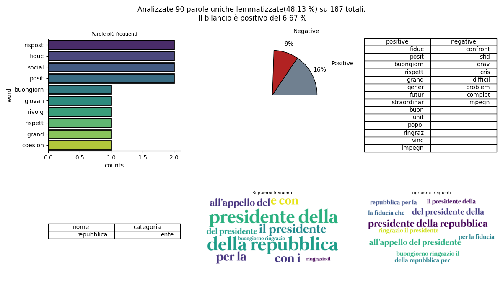

# spyker
Un tool per il riconoscimento vocale focalizzato sull'analisi semantica e sentimentale per la lingua italiana,

Nella cartella meta_outputs produce:

1. words_dataset.csv contenente le parole (escluse le stopwords) riordinate per frequenza
2. stemmed_words_dataset.csv contenente le parole stemmatizzate riordinate per frequenza
3. bigrams.csv contenente i bigrammi estrapolati dal testo
4. trigrams. csv contenente i trigrammi estrapolati dal testo

Nella cartella principale produce:

1. outputs.txt contenente il testo risconosciuto dall'assistente vocale

# "Le prime parole di Mario Draghi dopo aver ricevuto l'incarico da Mattarella"  da: https://www.youtube.com/watch?v=Zzg64LLQqlw:



### Specifiche
Per l'installazione di SpeechRecognition e pyaudio:

https://pypi.org/project/SpeechRecognition/

Per l'installazione e la configurazione di NLTK e Snowball Stemmer in Italiano:

https://www.nltk.org/

### Utilizzo
Dalla cartella:
```
pip install -r requirements.txt
```
dal terminale:
```
python3 spyker.py
```


